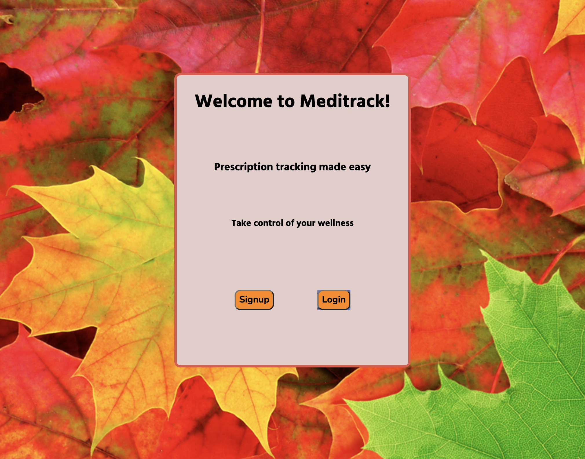
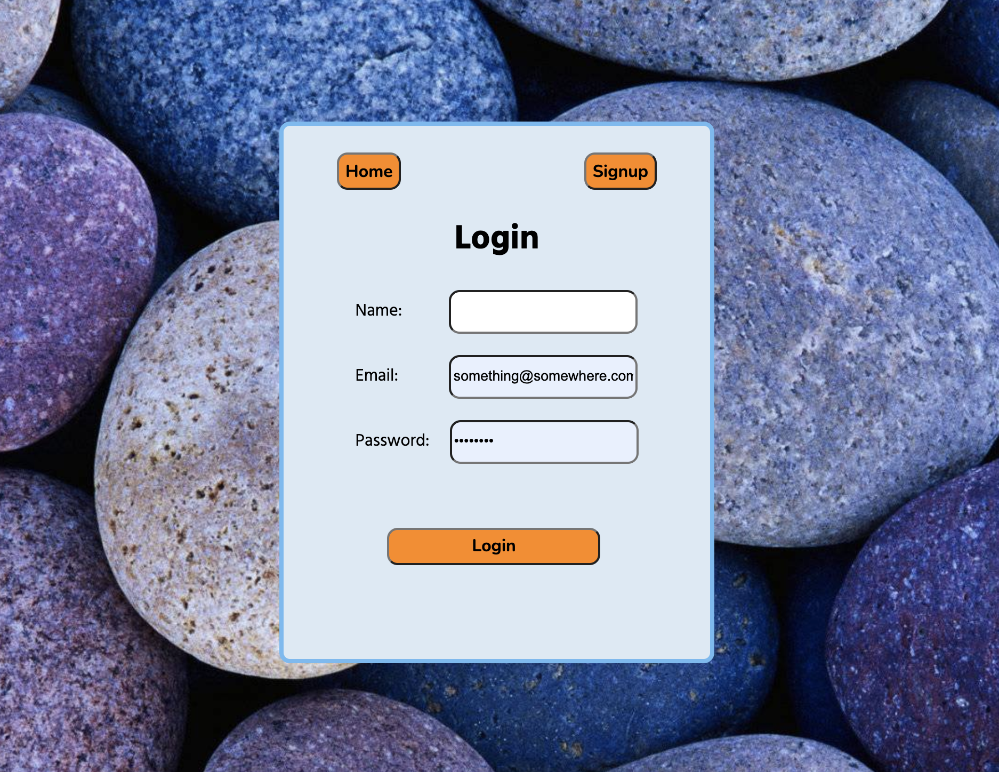
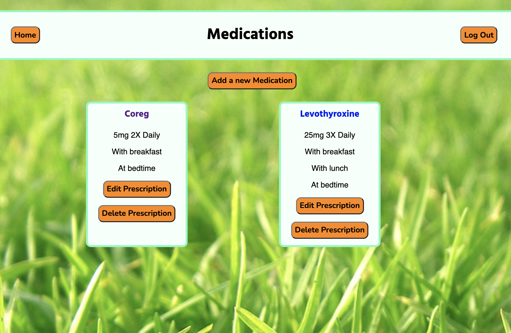
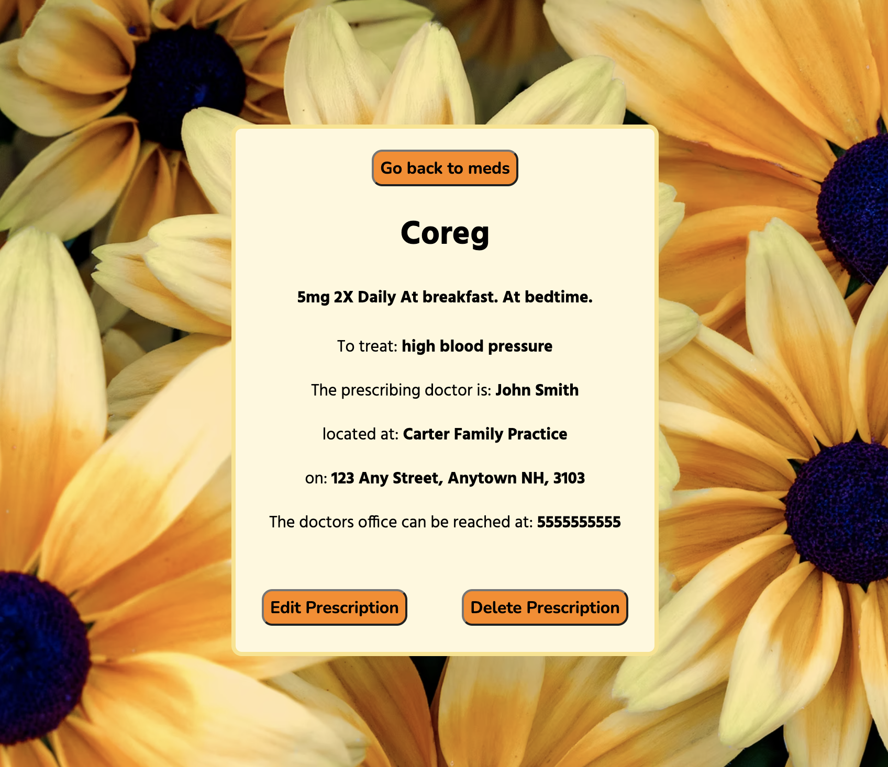
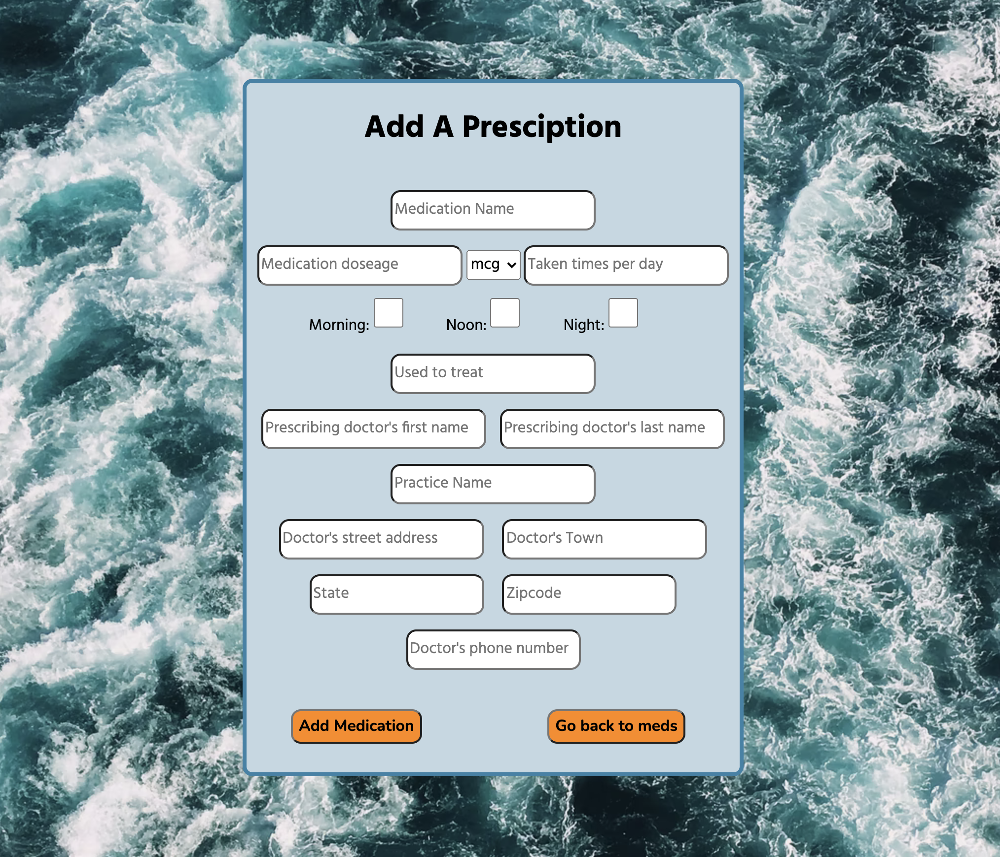
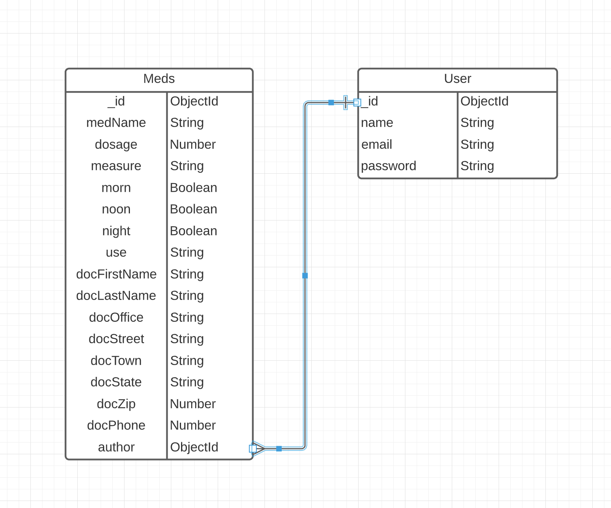
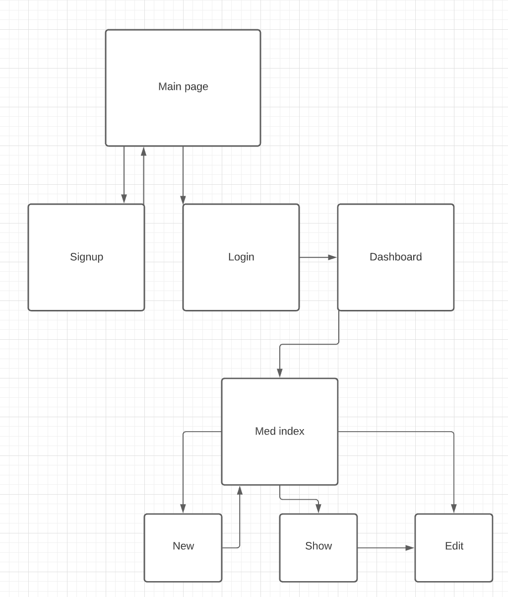

# Meditrack

Meditrack is a simple to use, user friendly medication tracking application. Be able to store your prescription information in one place for ease of access at any time. Prescription information includes the medication name, dosage, dose schedule, what ailment is being treated, and all of the prescribing physician information. With Meditracks user centric login and authorization, you can be confident your medication information is for your eyes only.

## This project was built with

- HTML5
- CSS3
- Javascript
- Node js
- express
- MongoDB
- mongoose
- google fonts

### See Deployed site here!

https://meditrack-app.herokuapp.com/?

#### Future enhancements

alerts to remind you to take your medications at specific times

Autofill medication names

cross check for drug interactions

Alerts when a prescription needs to be refilled

